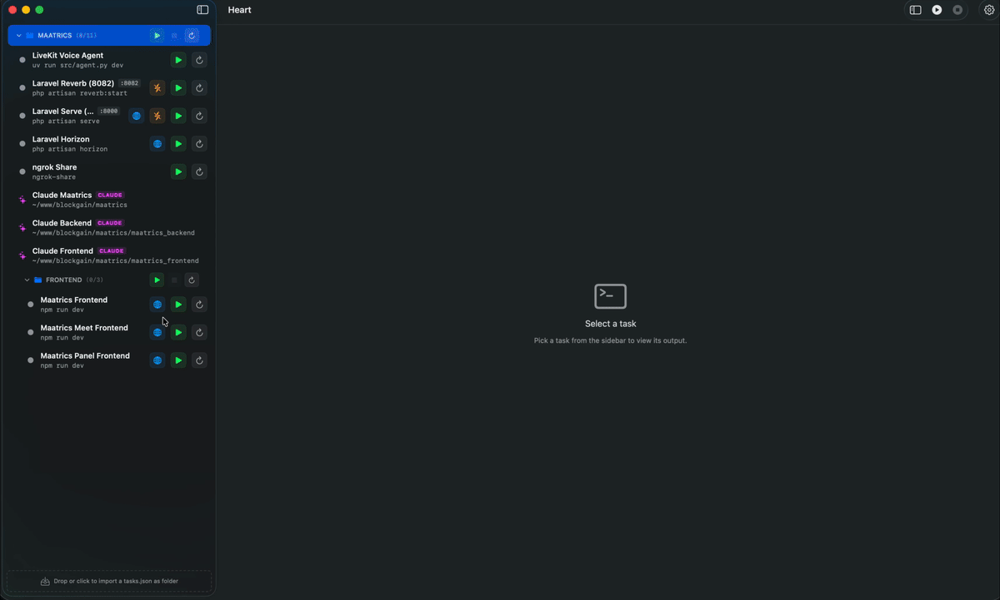

# Heart

> Run your whole stack from one window.
> Native macOS, ~5 MB, no Electron.

**Heart** is a single-window launcher for every service your project needs
— frontend, backend, workers, daemons. Start, stop, and watch them
without opening a terminal or juggling tabs. Your project stays tidy,
your focus stays on the code.

<p align="center">
  
</p>

<p align="center">
  
</p>

---

## Quick start

**1. Install Heart** — download
[`Heart.zip`](https://github.com/ocracy/heart/releases/latest), unzip,
drag `Heart.app` into `/Applications`, then in Terminal:

```bash
xattr -cr /Applications/Heart.app && open -a Heart
```

**2. Generate `heart.json` for your project** — `cd` into your project,
run `claude`, and paste:

> Read https://raw.githubusercontent.com/ocracy/heart/refs/heads/main/heart-json-generator.md
> and generate `heart.json` for this project following that format.

Claude fetches the spec, walks your codebase, infers ports, and writes
a ready-to-import `heart.json` at the project root (with Claude
shortcuts for every directory that has a `CLAUDE.md`).

**3. Import** — drag the generated `heart.json` onto Heart's sidebar.
Every service lands under your project's folder, ready to start.

That's it. One window, your whole stack.

> 💡 **Power-user shortcut.** Install the spec as a Claude Code skill
> once, and skip the URL after that:
> ```bash
> mkdir -p ~/.claude/skills/heart-json-generator && \
>   curl -fsSL https://raw.githubusercontent.com/ocracy/heart/main/heart-json-generator.md \
>   -o ~/.claude/skills/heart-json-generator/SKILL.md
> ```
> Then in any project just say: *"use the heart-json-generator skill"*.

---

## Features

### 📁 JSON config + named folders

Drop a `heart.json` onto the sidebar and Heart imports it as a folder. The
bundle's `name` becomes the folder name — no prompt, no setup. Drop a
second bundle, get a second folder. Each project stays scoped.

```json
{
  "name": "My Project",
  "tasks": [
    {
      "id": "api",
      "name": "API",
      "command": "php artisan serve",
      "cwd": "~/projects/my-project/api",
      "port": 8000,
      "url": "http://localhost:8000"
    },
    {
      "id": "web",
      "name": "Web",
      "command": "npm run dev",
      "cwd": "~/projects/my-project/web",
      "folder": "Frontend",
      "port": 5173,
      "url": "http://localhost:5173"
    }
  ]
}
```

Nested folders via slash: `"folder": "Backend/Workers"` → `My Project/Backend/Workers`.
The legacy bare-array shape is still accepted (the file just lacks a
top-level name → Heart prompts for one).

> 💡 **Generate this file automatically.** Use the bundled
> [`heart-json-generator.md`](heart-json-generator.md) as a Claude Code
> skill — Claude scans your repo, detects every backend / frontend / queue
> service, infers ports, and writes a ready-to-import `heart.json` (with
> Claude shortcuts pre-wired for each package directory).

### ✨ Claude Code support — multi-session shortcuts

Tag a task with `"kind": "claude"` and Heart treats it as an agent shortcut,
not a service:

```json
{
  "id": "claude-web",
  "name": "Claude (web)",
  "command": "claude",
  "cwd": "~/projects/my-project/web",
  "kind": "claude"
}
```

Click the shortcut and you get a multi-session detail pane:

- **+** opens another `claude` session in the same directory — fan out as
  many parallel agents as you want
- Each session has its own terminal pill: status dot, name, **pencil icon**
  to rename ("Bug fix", "Feature spike", "Quick question"), **X** to kill
  just that session
- Sessions **persist** across sidebar selection. Open three Claudes,
  switch to your Laravel terminal, come back — all three are still there,
  exactly as you left them
- Shift+Enter inserts a newline in the prompt without submitting (no
  `claude /terminal-setup` needed — Heart handles it natively)

### 🌐 Built-in browser per service

Set `"url"` on a task and you get a globe icon in the sidebar plus a
**Browser** tab in the detail pane:

- Address bar, back / forward, reload that actually works on flaky
  localhost servers
- 📱 Mobile toggle — clamps the viewport to 390 pt and swaps the
  user-agent so the page renders as iPhone Safari
- 🌐 **Open in Chrome** button — hands the current URL to the system
  Google Chrome (or the default browser if Chrome isn't installed)
- Cookies and localStorage persist across launches via the default WKWebView data store

### ⚡ One-click Activate overlay

Selected a task that's not running? Heart shows a big **Activate** button
right where the terminal would go, with the command displayed underneath.
Click it, the process starts, and the sidebar's play icon flips to stop
in sync.

When a task crashes, the same overlay shows the exit code and a
**Restart** button.

### 🚀 Real terminal — iTerm-class

Powered by [SwiftTerm](https://github.com/migueldeicaza/SwiftTerm)
(xterm-256color compatible). Renders ANSI colors, cursor positioning,
mouse, scrollback, and TUIs — `vim`, `htop`, `ngrok`, `k9s`, `claude`,
`fzf` all work exactly as they would in iTerm2 or Apple Terminal. PTY
size follows the SwiftUI view (`TIOCSWINSZ` on resize), so full-screen
TUIs reflow correctly when you resize the window or collapse the sidebar.

### 🪟 Collapsible sidebar

Hit `⌃⌘S` (or click the toolbar button) to hide the sidebar. The terminal
+ browser take the whole window — distraction-free coding mode.

### 🛡️ Clean shutdown — no orphan ports

Cmd+Q runs every running task through a graceful chain in parallel:

1. **Ctrl+C** through the PTY (SIGINT to the foreground process group)
2. **`killpg(SIGTERM)`** to the entire process group — covers shell
   children that wouldn't otherwise receive a signal when the parent zsh
   dies
3. Up to 2 s shared wait so all tasks drain in parallel
4. **`killpg(SIGKILL)`** for any stragglers

Result: the next launch finds 8000, 5173, 8082 all free. Force-quit is
the only case Heart can't recover from (no handlers run on SIGKILL from
the OS).

### 🔌 KILL PORT button

For when something *else* on your machine is still pinning :8000.
Click → `lsof -ti tcp:8000 | xargs kill -9`, scoped to the task's port.

### ⌨️ Login shell that respects your dotfiles

Commands run under `/bin/zsh -l -i -c` — both `.zprofile` *and* `.zshrc`
sourced, so your custom PATH, aliases, fnm, mise, asdf, and rbenv hooks
all work without surprises.

---

## Install

### From a release

Grab the latest [**Heart.zip**](https://github.com/ocracy/heart/releases/latest):

1. Unzip → drag `Heart.app` into **`/Applications`**.
2. In Terminal:
   ```bash
   xattr -cr /Applications/Heart.app && open /Applications/Heart.app
   ```
3. Launch from Spotlight (`⌘+Space` → "heart") on subsequent runs.

> **Why step 2?** Heart is ad-hoc signed. The `xattr` command clears
> `com.apple.quarantine` — safe and one-time only.

**Don't want to use Terminal?** Finder → right-click `/Applications/Heart.app`
→ **Open** → **Open** in the dialog.

### From source

```bash
git clone https://github.com/ocracy/heart.git
cd heart
./install.sh
```

Installs to `/Applications/Heart.app`. Requires macOS 13+ and Swift 5.9
(Xcode Command Line Tools).

---

## First run

Heart starts with two placeholder tasks. Three ways to add your own:

**A. Drag-and-drop** — drop a `heart.json` (or any `tasks.json`) onto the
dashed area at the bottom of the sidebar. If the JSON has a top-level
`name`, the import is silent — your tasks land under that folder
immediately. Otherwise Heart prompts for a folder name.

**B. Right-click → Edit** — modify any task in a clean form. Saves to
disk on every keystroke commit.

**C. Settings → JSON editor** (`⌘+,`) — paste raw JSON, validate, save.

A starter [`tasks.example.json`](tasks.example.json) ships with the repo.

---

## tasks.json schema

Two accepted shapes:

```jsonc
// Bundle (preferred — auto-imports under "name", no prompt):
{
  "name": "My Project",
  "tasks": [ /* DevTask[] */ ]
}

// Or just a bare array (legacy, prompts for folder name):
[ /* DevTask[] */ ]
```

Each task:

| Field       | Type      | Notes                                                                    |
|-------------|-----------|--------------------------------------------------------------------------|
| `id`        | string    | Unique key (slug or UUID)                                                |
| `name`      | string    | Sidebar label                                                            |
| `command`   | string    | Runs under `/bin/zsh -l -i -c`                                           |
| `cwd`       | string    | Absolute path or `~/...` (tilde is expanded)                             |
| `port`      | int?      | If set: enables readiness check + KILL PORT button                       |
| `url`       | string?   | Adds globe icon + in-app Browser tab                                     |
| `folder`    | string?   | Sidebar grouping. Slash-separated for nesting: `Backend/Workers`         |
| `kind`      | string?   | `"claude"` → multi-session shortcut, pinned with sparkles badge           |
| `autoStart` | bool?     | Reserved — saved but not yet acted on                                    |

Persisted at `~/Library/Application Support/Heart/tasks.json`.

---

## Workflow — what one window looks like

```
1. Drop heart.json (your project's config) → all services + Claude shortcuts appear
2. Click each row's play icon → full stack spins up in seconds
3. Click the globe icon → see the live preview without leaving Heart
4. Click a Claude shortcut → terminal opens with `claude` in that dir
5. Need a parallel agent? + → second session, both alive, name them
6. Cmd+Q when done — every port is freed
```

That's the whole thing. One window. Everything together.

---

## Scripts

```bash
./build.sh     # release build → ./Heart.app (no install)
./install.sh   # build + install to /Applications/Heart.app
./dist.sh      # universal (arm64 + x86_64) → Heart.zip for distribution
```

To regenerate just the icon:
```bash
swift scripts/make-icon.swift && iconutil -c icns AppIcon.iconset -o AppIcon.icns
```

---

## Uninstall

```bash
rm -rf /Applications/Heart.app
rm -rf ~/Library/Application\ Support/Heart
```

---

## Tech stack

- Swift 5.9, SwiftUI, AppKit (macOS 13+)
- [SwiftTerm](https://github.com/migueldeicaza/SwiftTerm) — terminal emulation (xterm-256color, mouse, scrollback)
- WKWebView — in-app browser
- Foundation `Process` + `forkpty` (via SwiftTerm) — child management
- Swift Package Manager (no Xcode project)
- Sandbox disabled (required to spawn arbitrary child processes)
- ~5 MB binary

---

## License

MIT — see [LICENSE](LICENSE).
