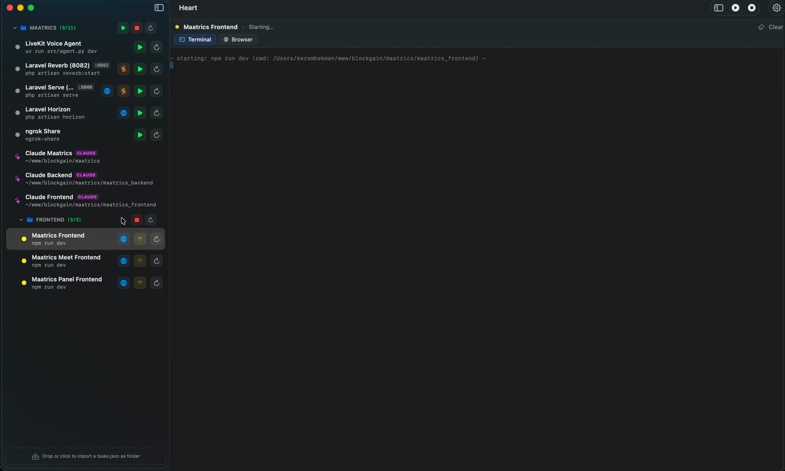

# Heart

> A native macOS launcher for all your local dev processes — start, stop, and
> restart them from a single window. From `ngrok` to `npm run dev` to a Laravel
> queue worker, everything in one place.

**Heart** is a SwiftUI app for the commands you run ten times a day on your
dev machine. It replaces the tabs‑in‑Terminal / `tmux` / `screen` shuffle
with a single window: green dot means running, click to stop, drag to
reorder, share a `tasks.json` with your team. ~5 MB binary, real PTY,
sandbox‑free.

<p align="center">
  
</p>

## Features

- **Start / Stop / Restart** — one tap per task
- **Nested folders** — group tasks, run start/stop on the entire group
- **Drag‑and‑drop import** — drop a `tasks.json` onto the sidebar to add it as a folder
- **Right‑click → Edit** — change port, folder, command, cwd from the UI; the JSON file stays in sync
- **Real PTY** — `script(1)` allocates a TTY, so `ngrok`, `htop`, `top` render correctly
- **Interactive terminal** — type into the output panel; Ctrl+C / Ctrl+D / arrow keys forward to the PTY
- **Port readiness check** — yellow spinner until your service actually binds, then green
- **KILL PORT** button — `lsof -ti tcp:<port> | xargs kill -9`, scoped to the task's port
- **Login shell** — commands run under `/bin/zsh -l -i -c`, so your `~/.zshrc` PATH and aliases work
- **Graceful shutdown** — SIGINT → 3 s SIGTERM → 3 s SIGKILL; ⌘Q cleans up every child

---

## Install

### From a release build (recommended)

Grab the latest [**Heart.zip**](https://github.com/ocracy/heart/releases/latest), then:

1. Unzip → drag `Heart.app` into **`/Applications`**.
2. Open Terminal and run (clears the quarantine flag and launches the app):
   ```bash
   xattr -cr /Applications/Heart.app && open /Applications/Heart.app
   ```
3. Launch from Spotlight (`⌘+Space` → "heart") on subsequent runs.

> **Why step 2?** Heart is ad‑hoc signed (no paid Apple Developer account
> behind it). The `xattr` command only clears `com.apple.quarantine` —
> safe and one‑time only.

**Don't want to use Terminal?**
- Finder → right‑click `/Applications/Heart.app` → **Open** → click **Open** in the dialog.
- Or System Settings → Privacy & Security → scroll down → "Heart was blocked..." → **Open Anyway**.

### From source

```bash
git clone https://github.com/ocracy/heart.git
cd heart
./install.sh
```

Installs to `/Applications/Heart.app`. Requires macOS 13+ and Xcode Command
Line Tools (Swift 5.9+).

---

## First run

A fresh install ships with two generic placeholder tasks. Three ways to add
your own:

**A. Drag‑and‑drop** — drop a `tasks.json` onto the dashed area at the bottom
of the sidebar. You'll be asked to name a folder, and every task without
its own `folder` field lands inside it. Tasks that already declare a folder
are nested under it (e.g. dropping with name `Maatrics`, a task with
`"folder": "Frontend"` ends up at `Maatrics/Frontend`).

**B. Right‑click → Edit** — modify any existing task in a clean form.
Every save writes to disk immediately.

**C. Settings → JSON editor** (`⌘+,`) — paste raw JSON, validate, save.

A starter [`tasks.example.json`](tasks.example.json) is in the repo. Drop
it on the sidebar to see folder grouping, ports, and ngrok in one go.

---

## tasks.json schema

```json
[
  {
    "id": "web-dev",
    "name": "Web dev server",
    "command": "npm run dev",
    "cwd": "~/projects/web",
    "port": 3000,
    "folder": "Frontend",
    "autoStart": false
  }
]
```

| Field       | Type      | Notes                                                              |
|-------------|-----------|--------------------------------------------------------------------|
| `id`        | string    | Unique key (slug or UUID)                                          |
| `name`      | string    | Sidebar label                                                      |
| `command`   | string    | Runs under `/bin/zsh -l -i -c`                                     |
| `cwd`       | string    | Absolute path or `~/...` (tilde is expanded)                       |
| `port`      | int?      | If set: enables readiness check + KILL PORT button                 |
| `folder`    | string?   | Sidebar grouping. Use `/` for nesting — e.g. `Backend/Workers`     |
| `autoStart` | bool?     | Reserved — saved but not yet acted on by the UI                    |

Config file: `~/Library/Application Support/Heart/tasks.json`

---

## Scripts

```bash
./build.sh     # release build, produces ./Heart.app (no install)
./install.sh   # build + install to /Applications/Heart.app
./dist.sh      # universal (arm64 + x86_64), ad-hoc signed, packaged as Heart.zip
```

To regenerate just the icon:
```bash
swift scripts/make-icon.swift && iconutil -c icns AppIcon.iconset -o AppIcon.icns
```

---

## Uninstall

```bash
rm -rf /Applications/Heart.app
rm -rf ~/Library/Application\ Support/Heart
```

---

## Tech stack

- Swift 5.9+ + SwiftUI (macOS 13+)
- `/usr/bin/script` for PTY allocation
- Foundation `Process` + `Pipe` for child‑process management
- Swift Package Manager (no Xcode project — `./build.sh` produces the `.app` bundle)
- ~5 MB binary, sandbox disabled (required for spawning child processes)

---

## License

MIT — see [LICENSE](LICENSE).
